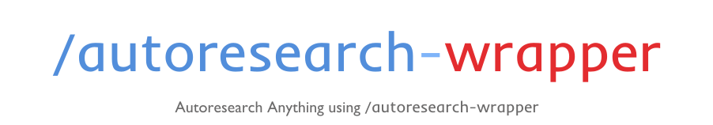
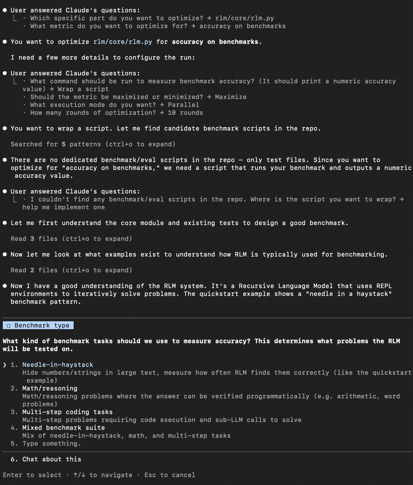

<div align="center">



# Autoresearch Wrapper

**面向任意代码仓库的 dependency-aware 优化引擎。**

扫描、规划、隔离、测量、迭代 —— 全部在 Git worktree 中自动完成。

基于 [Karpathy 的 autoresearch](https://github.com/karpathy/autoresearch) —— 约束 + 机械化指标 + 自主迭代 = 持续增益。

[](https://docs.anthropic.com/en/docs/claude-code)
[](https://platform.openai.com/docs/codex)
[](https://github.com/HenryCai11/autoresearch-wrapper/releases)
[](LICENSE)
[](https://github.com/karpathy/autoresearch)

<br>

*"扫描仓库 → 选择目标 → 锁定指标 → Claude/Codex 跑循环 → 你醒来看结果"*

<br>

[安装](#安装) · [使用](#使用) · [命令](#命令) · [详细文档](./DETAILS.md) · [English](./README.md)

</div>

---

最近我在用Codex的时候，会让它去针对某些模块写一些相对应的autoresearch脚本。 有一次我想要往系统里面新加一个功能，其中有几个备选项，这时候想要评估每个备选项真正的表现就得同时优化那些和它相关的参数/模块(`autoresearch-wrapper-create`). 就在这个瞬间，我想是时候写一个SKILL来做这件事了（看了一圈好像确实没人实现这个功能，于是我就开始了）。随之而来的一个想法是，或许在优化一个系统之前，搞清楚各个模块之间相互的依赖关系是有用的，所以这成了这个项目的核心————依赖感知的自动科研（优化）引擎。

## 进展

- 2026/03/23 北京时间凌晨2:31: 虽然只开发测试到v0.0.2，我决定还是直接开源了！大半夜开始试用之后很激动，想快点和社区分享。虽然时间有限同时也还在确保每一个我想要的功能都已经正确实现，但我觉得它已经做好准备开始干活了（狗头）。


## 安装

<details open>
<summary><b>Claude Code（推荐）</b></summary>

```bash
/plugin add HenryCai11/autoresearch-wrapper
```

或手动安装：

```bash
git clone https://github.com/HenryCai11/autoresearch-wrapper.git
```

Claude Code 会自动从 `.claude/skills/` 发现 skill。如果仓库在项目外，用符号链接：

```bash
mkdir -p /path/to/your-project/.claude/skills
ln -s /path/to/autoresearch-wrapper/.claude/skills/* /path/to/your-project/.claude/skills/
```

</details>

<details>
<summary><b>Codex</b></summary>

```bash
mkdir -p ~/.codex/skills
ln -s /path/to/autoresearch-wrapper ~/.codex/skills/autoresearch-wrapper
```

安装后重启 Codex。

</details>

<details>
<summary><b>仅 CLI</b></summary>

无需安装，直接运行：

```bash
python3 scripts/autoresearch_wrapper.py scan
```

</details>

## 使用

直接跑
```
/autoresearch-wrapper
```
然后你会进入一个引导界面（类似plan mode），一步步选择最后开始优化你想优化的模块。

## Examples

这是我想要优化[Recursive Language Models](https://github.com/alexzhang13/rlm)时候，引导界面的样子（Claude Code）



## 命令

| Codex | Claude Code | CLI | 说明 |
| --- | --- | --- | --- |
| `/autoresearch-wrapper` | `/autoresearch-wrapper` | `scan` / `wrap` | 扫描仓库或包装脚本 |
| `:status` | `-status` | `status` | 查看状态和就绪情况 |
| `:run` | `-run` | `run` | 启动或恢复运行 |
| `:flow` | `-flow` | `flow` | 指标历史和图表 |
| `:create` | `-create` | `create` | 多候选功能添加 |
| `:delete` | `-delete` | `delete` | 删除后参数优化 |
| `:monitor` | `-monitor` | `monitor` | 实时进度轮询 |

其他 CLI 子命令：`configure`、`allocate`、`evaluate`、`record`、`resources`、`preset-metric`、`reference`

## 测试

```bash
python3 -m unittest -q
```

## 文档

| 文档 | 内容 |
| --- | --- |
| [DETAILS.md](./DETAILS.md) | 功能细节、依赖图说明、生成目录结构、典型工作流 |
| [CORE_FEATURES.md](./CORE_FEATURES.md) | 功能清单 |
| [CONTRIBUTING.md](./CONTRIBUTING.md) | 开发工作流、分支布局、验证 |
| [THIRD_PARTY_NOTICES.md](./THIRD_PARTY_NOTICES.md) | 上游归属声明 |


## 致谢

这个项目受到了其他一些autoresearch项目的启发，分别是[Karpathy's autoresearch](https://github.com/karpathy/autoresearch)和[uditgoenka's autoresearch](https://github.com/uditgoenka/autoresearch). 万般感谢！